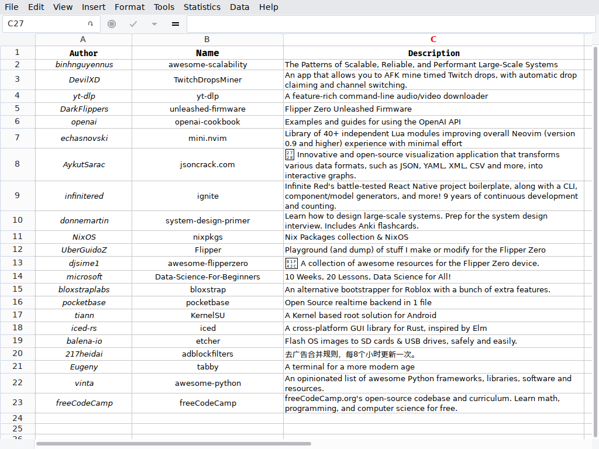
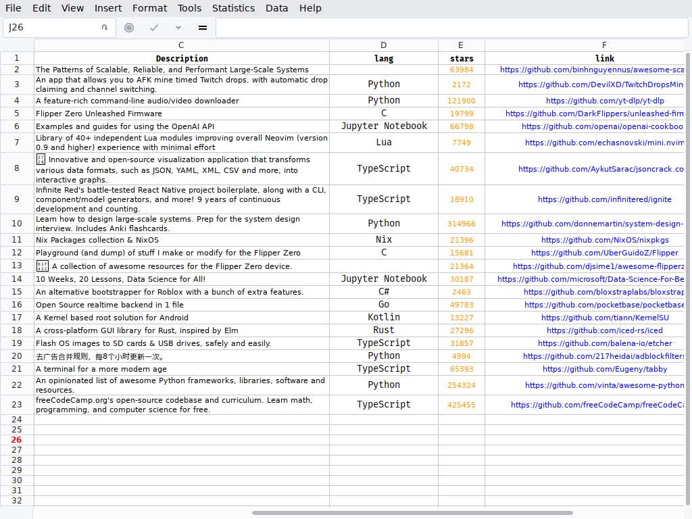

# GitHub Trends Scraper





This is a python script that scraps GitHub trends from the official website, it scraps repos in the page and save them to a CSV file so you can view them easily on Excel or any other spreadsheet.

This project is built using:

1. Python
2. BeautifulSoup *(module)*
3. Requests *(module)*
4. CSV *(module)*

## Installation

run this command in your python enviornment or globally:

```bash
$ pip install requests beautifulsoup4

```
## License

This project is under [MIT License](https://github.com/omarhossam750/github-trends-scraper/blob/main/LICENSE)


